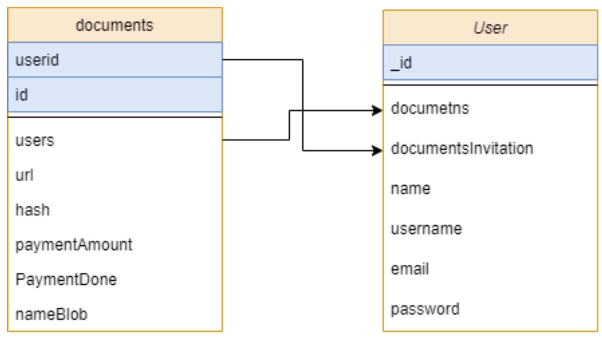

# E-sign Contracts - App Web Deployment 

# Backend
Github 
 Todo el código involucrado se puede encontrar en este repositorio de Github. Hay dos directorios:
- API: Aquí está todo el código de nuestro backend, con algunos ejemplos de prueba para cada método.
## Dependencies 
Cada sección tiene una visión general de las dependencias necesarias para ejecutar (si corresponde). Por ejemplo, usamos "Azure functions" para poder recibir las request del frontend y poder regresar valores de la base de datos. Esto se explica con más detalle en la sección "usos principales".

## Prerrequisitos
- Suscripción de Azure
- Azure functions en Node.js.
- Blob container

## Usos principales 
### Blob Container
Utilizamos Azure Blob Storage ya que este nos facilita la creación de largo datos y con esto poder satisfacer las necesidades de un el análisis y proporciona almacenamiento para crear y poder obtener los certificados en modo pdf.Esto nos ayuda a poder optimizar los costos con almacenamiento en capas para los datos a largo plazo y escale los recursos verticalmente con flexibilidad para las cargas de trabajo de informática de alto rendimiento y de aprendizaje automático.

Para el uso de blob container primero debes de tener tus claves para realizar la conexión y instalar azure/storage-blob y hacerse uso de este deberás de llamarlo 
```
const AZURE_STORAGE_CONNECTION_STRING = process.env.AzureWebJobsStorage;
const { BlobServiceClient } = require('@azure/storage-blob')
```
Para subir un pdf deberá de realizar la coneccion y encontra el nombre del container y del blob, para que al final podamos hacer uso de la función upload, manda como parámetros el archivo completo y el tamaño de archivo  
```
BlobServiceClient.fromConnectionString(AZURE_STORAGE_CONNECTION_STRING);
const containerClient = await blobServiceClient.getContainerClient(containerName);
containerClient.getBlockBlobClient(blobName);
await blockBlobClient.upload(filedata,filedata.length);
```
### Azure functions
Este backend fue realizado por medio de azure functions con la funcionalidad de  crear una aplicación web, realizada con el lenguaje de programación de Node.js y mongoDB, la cual está configurada por medio de los servicios de Azure y alojada en esta, adicionalmente hacemos uso de mongo atlas para almacenar nuestras bases de datos. para poder usar las azure functions necesitar de la CLI de Azure Tools para ejecutar y depurar localmente; y, por último, proporcionar comandos para implementar en Azure functions. 
La aplicación se hace cargo de poder acceder a la base de datos y responder un serie de request proporcionada por el cliente, la aplicación se encarga de recibir las los documentos del cliente y generar un url con el archivo pdf  y guardar o borrar la información de los documentos.

# Estructura del repositorio
El proyecto debe seguir la siguiente estructura de carpetas, la cual generamos por usted:
```
- / 		         #Raíz de todo el proyecto
- README.md		   #Carpeta con la function crear clase
- CreateDocument	   #Carpeta con la function crear Documento
- DeleteDocuments	   #Carpeta con la function Borrar Documento
- DocumentsById	   #Carpeta con la function obtener los documentos por id 
- DocumentsInvById      #Carpeta con la function obtener las inv documentos por id  
- getId			   #Carpeta con la function obtener el id del user 
- authenticate		   #Carpeta con la function para hacer login del 
- InvitationsDocumets	   #Carpeta con la function obtener los documentos por id 
- register		   #Carpeta con la function para crear user nuevos
- UpdateByID            #Carpeta con la function para actualizar los datos del user 
- UploadFile            #Carpeta con la function para subir archivos al blob
- stripe  		   #Carpeta con la function para recibir pagos 
- db.js		 	   #Carpeta con la configuración de la base 
- models			   #Carpeta donde se almacena los modelos y schemas
- host.json		   #versión del azure functions  
- local.settings.json   #configuración de las functions
- server.js		   #funcion principal con todas las funciones
```

## Quickstart
Guia para correr el programa de manera rápida
- Debes hacer login con tu azure account y instalar Azure Tool core
1. Clonar repositorio e ir hacia la carpeta
```bash 
git clone git clone https://github.com/Lira97/FunctionsBlockchain
```
3. Debes de tener npm instalado

4. Run npm para instalar dependecias 
```bash 
npm install
``` 
5. Install Azure Functions:
[Instructions](https://docs.microsoft.com/en-us/azure/azure-functions/functions-run-local?tabs=macos%2Ccsharp%2Cbash#brew)

6. Run Azure Functions con azure tools:
```bash 
func host start
```  
## Uso
Esta es una explicación más detallada de los archivos y funciones principales que se usan.

## Azure Functions custom handler in JavaScript

The samples available in this folder demonstrate how to implement a in JavaScript.

Example functions featured in this repo include:

| Name | Trigger |
|------|---------|
| [authenticate](authenticate) | HTTP
| [CreateDocument](CreateDocument) | HTTP
| [DeleteDocuments](DeleteDocuments) | HTTP
| [DocumentsById](DocumentsById) | HTTP
| [DocumentsInvById](DocumentsInvById) | HTTP
| [getId](getId) | HTTP
| [InvitationsDocumets](InvitationsDocumets) | HTTP
| [register](register) | HTTP
| [UpdateByID](UpdateByID) | HTTP
| [UploadFile](UploadFile) | HTTP

## Azure Functions inputs examples 'Body'

[authenticate](authenticate) 
```json
{
	"username":"esme",
	"password":"password"
}
```
[CreateDocument](CreateDocument)
```json
 {
 	"userID":"5e9e6ddd27fd64588e24cafe",
    "hash": "seerefedsz",
    "url": "https://storageaccountapren8dfe.blob.core.windows.net/documentos/Medicalchain-Whitepaper-EN.pdf1999db20-979b-11ea-8d66-cb7a86a8f2a6.pdf",
    "users": ["5ebb8a421ac1502e58848503","5ebb4b27361040f2b2785b12"],
    "paymentAmount": 200, 
    "paymentDone": false,
    "nameBlob":"us-blockchain-opportunities-for-health-care.pdf"
  }
```
[DeleteDocuments](DeleteDocuments)
```json
{
	"idDocument":"5ec344b0cef7045753deb615",
	"idUser":"5e9e6ddd27fd64588e24cafe"
}

```
[DocumentsById](DocumentsById)
```json
{
	"id":"5ebb4b27361040f2b2785b12"
}
```
[DocumentsInvById](DocumentsInvById)
```json
{
	"id":"5ebb4b27361040f2b2785b12"
}
```
[getId](getId)
```json
{
	"name": "Esmeralda",
    "username": "esme",
    "email": "esme.mag@gmail.com",
    "password": "password"
}
```
[InvitationsDocumets](InvitationsDocumets)
```json
{
	"idUser":"5ebb4b27361040f2b2785b12",
	"response":false,
	"documentsInvitation":"5ec30021da59141538945ab8"
}
```
[register](register)
```json
{
	"name": "Esmeralda",
    "username": "esme",
    "email": "esme.mag@gmail.com",
    "password": "password"
}
```
[UpdateByID](UpdateByID) Need to send 'id' in params
```json
{
	"id":"5ec34911e815b958abac69a7"
}
{
	"paymentDone":true
}
```
[UploadFile](UploadFile)
```json
{
  "File": "File.PDF",
}
```
## Diagrama de Base



## Configuration

Local.settings-example.json  se proporciona para mostrar los valores que la aplicación espera leer de las variables de entorno. Haga una copia de * local.settings-example.json * y cámbiele el nombre * local.settings.json * y reemplace cualquier valor que comience por "** YOUR _ **" con sus valores.

# Frontend
Está desarrollado con Vue.js y Bootstrap
Github
El código del frontend puede ser encontrado en el siguiente repositorio: 

https://github.com/esmemag96/blockchain-front.git

## Dependencias
Node.js 
Backend previamente mencionado corriendo 
Cuenta de MetaMask

## Quickstart
Guia para correr el programa de manera rápida
Debes hacer login con tu azure account y instalar Azure Tool core
Clonar repositorio e ir hacia la carpeta
git clone git clone Guia para correr el programa de manera rápida
- Debes hacer login con tu azure account y instalar Azure Tool core
1. Clonar repositorio e ir hacia la carpeta
```bash 
git clone git clone https://github.com/esmemag96/blockchain-frontend.git
```
3. Debes de tener npm instalado

4. Run npm para instalar dependecias 
```bash 
npm install
``` 
5. Corre el siguiente comando para correr la aplicación

```bash 
npm run serve
```  
 
